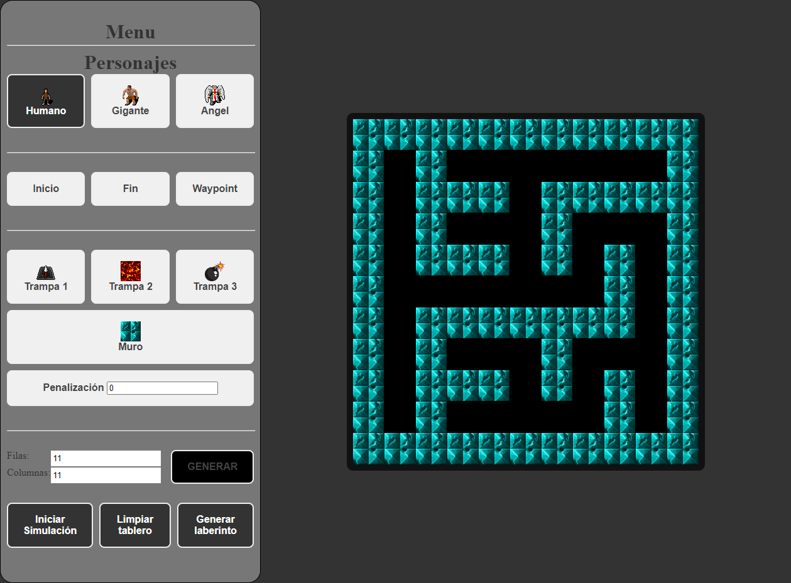

# Ingenieria del Conocimiento

Implementación de varios algoritmos para la asignatura Ingeniería del Conocimiento de 4º año del Grado en Ingeniería del Software.
[Github Pages](https://tiberiuss.github.io/IC/)

## Algoritmo A*

## Árboles de decisión ID3

## Algoritmos de clasificación(Bayes, K-medias, Lloyd)

